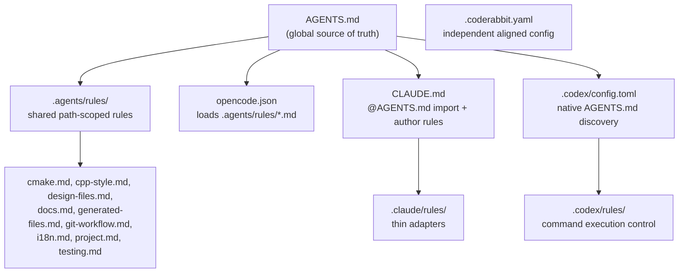

# AI Agent Harness

This document describes the cross-tool AI agent configuration used in this project. Multiple AI coding assistants share global and path-scoped guidance while retaining tool-specific settings where needed.

## Overview

AI coding tools (Claude Code, OpenAI Codex, CodeRabbit, etc.) each have their own configuration format. Rather than maintaining duplicate guidelines in every tool's config, this project uses a layered architecture:

1. **AGENTS.md** — shared global guidelines that all tools can read
2. **.agents/rules/** — shared path-scoped rules with a Claude Code-like shape
3. **Tool-specific configs** — import or reference shared files, adding only tool-unique settings

This means a global change to AGENTS.md, or a path-scoped change in `.agents/rules/`, can benefit every configured tool after running `scripts/sync-agent-rules.py`.

## Architecture



## Bootstrap Guidelines (AGENTS.md)

`AGENTS.md` at the repository root is intentionally short. It contains:

- a project summary
- instructions for loading `.agents/rules/*.md`
- a rule index
- critical guardrails that should remain visible before any path-specific rule
  is selected

**Update policy**: Put detailed guidance in `.agents/rules/`. Keep `AGENTS.md`
as a bootstrap file unless a rule must be visible before path matching happens.
Tool-specific configs should never duplicate content that belongs in the shared
files.

## Shared Path-Scoped Rules

`.agents/rules/` stores reusable rule files with Markdown front matter:

```yaml
---
paths:
  - "**/*.cpp"
  - "**/*.h"
---
```

The `paths` list describes when the rule applies. Tools that support native
path-scoped rules can import or adapt these files directly. Tools that cannot
activate rules by path should load them as general context and use the `paths`
front matter as an instruction hint.

Current shared rules:

| File | Purpose |
|------|---------|
| `.agents/rules/cmake.md` | CMake module, dependency, and test registration rules |
| `.agents/rules/cpp-style.md` | C++17, Qt, ownership, and formatting rules |
| `.agents/rules/design-files.md` | Pencil `.pen` design file handling |
| `.agents/rules/docs.md` | English/Japanese documentation rules |
| `.agents/rules/generated-files.md` | Build outputs and generated file handling |
| `.agents/rules/git-workflow.md` | PR title and release-please guardrails |
| `.agents/rules/i18n.md` | Qt translation workflow |
| `.agents/rules/project.md` | Build, architecture, dependencies, hooks, and harness rules |
| `.agents/rules/testing.md` | Google Test and CTest rules |

## Sync Workflow

Run the sync script after changing `AGENTS.md` or `.agents/rules/*.md`:

```bash
scripts/sync-agent-rules.py
```

The script regenerates:

| Output | Source | Purpose |
|--------|--------|---------|
| `.claude/rules/*.md` | `.agents/rules/*.md` | Claude Code path-scoped adapters |

OpenCode does not require sync: `opencode.json` uses a glob pattern
(`".agents/rules/*.md"`) in its `instructions` field, so it is
self-maintaining — newly added or removed rule files are picked up
automatically.

Run the full harness check before opening a PR that changes the harness:

```bash
scripts/check-agent-harness.sh
```

The check syncs adapters, compiles the sync script, checks diff whitespace, and
fails if generated adapters are stale.

## Tool-Specific Configurations

### OpenCode

| File | Purpose |
|------|---------|
| `AGENTS.md` | Bootstrap guidelines (auto-discovered by OpenCode) |
| `opencode.json` | Project-level config with `instructions` glob to load `.agents/rules/*.md` |
| `~/.config/opencode/AGENTS.md` | Personal global rules (not tracked) |
| `.opencode/` | Custom agents, commands, skills, plugins (not tracked) |

**How it works**: OpenCode reads `AGENTS.md` at startup and loads all
`.agents/rules/*.md` files via the `instructions` array in `opencode.json`.
The glob pattern matches all shared rule files, so new or removed rules are
automatically picked up without running the sync script. Path-scoped rules
are loaded as general context; OpenCode relies on the front matter `paths`
hint to decide applicability.

### Claude Code

| File | Purpose |
|------|---------|
| `CLAUDE.md` | Imports AGENTS.md via `@AGENTS.md`, adds author attribution rules |
| `.claude/rules/*.md` | Path-scoped adapters that import matching `.agents/rules/*.md` files |
| `.claude/settings.local.json` | Tool permissions (local, not committed) |

**How it works**: Claude Code reads `CLAUDE.md` at startup, which uses `@AGENTS.md` to inline the shared global guidelines. The `.claude/rules/` directory provides path-scoped adapters; each adapter keeps Claude's `paths` front matter and imports the matching shared rule from `.agents/rules/`.

### OpenAI Codex

| File | Purpose |
|------|---------|
| `.codex/config.toml` | Project-level settings (approval mode) |
| `.codex/rules/project.rules` | Command execution control (Starlark) |

**How it works**: Codex discovers `AGENTS.md` natively by walking the directory tree from the git root. `AGENTS.md` points Codex to `.agents/rules/` for shared path-scoped guidance. The `.codex/config.toml` sets project defaults (e.g., `approval_mode`), and `.codex/rules/` controls which shell commands Codex can run without user approval.

The rules file uses Starlark `prefix_rule()` to classify commands:
- **allow** — build, test, format, read-only git operations
- **prompt** — git add, commit, push (requires user confirmation)
- **forbidden** — force push, hard reset (never allowed)

### CodeRabbit

| File | Purpose |
|------|---------|
| `.coderabbit.yaml` | PR review configuration with path-based instructions |

**How it works**: CodeRabbit is a GitHub PR review bot. It does not read AGENTS.md directly, but its `path_instructions` section mirrors the same coding standards. It is configured independently but kept aligned with AGENTS.md and `.agents/rules/`.

When changing `.agents/rules/`, update `.coderabbit.yaml` if the same guidance
should appear in PR review comments.

## Adding a New AI Tool

When adding support for a new AI coding assistant:

1. **Check native AGENTS.md support** — Many tools can read AGENTS.md or similar markdown files. If supported, configure the tool to read it.
2. **Create a thin adapter** — If the tool supports path-scoped rules, adapt `.agents/rules/` rather than writing new guidance.
3. **Create tool-specific config only for tool behavior** — Permission models, approval modes, author attribution rules, and UI settings belong in tool-specific files.
4. **Do not duplicate shared content** — The tool-specific config should reference or import shared guidance where possible.
5. **Update this document** — Add the new tool to the Architecture diagram and Tool-Specific Configurations section.

## File Reference

| File | Tool | Tracked | Description |
|------|------|---------|-------------|
| `AGENTS.md` | All | Yes | Shared project guidelines |
| `.agents/README.md` | All | Yes | Shared rule schema and adapter policy |
| `.agents/rules/*.md` | All | Yes | Shared path-scoped rules |
| `opencode.json` | OpenCode | Yes | Project config with instructions glob |
| `CLAUDE.md` | Claude Code | Yes | Imports AGENTS.md + author rules |
| `.claude/rules/*.md` | Claude Code | Yes | Path-scoped adapters importing shared rules |
| `.claude/settings.local.json` | Claude Code | No | Local tool permissions |
| `.codex/config.toml` | OpenAI Codex | Yes | Project settings |
| `.codex/rules/*.rules` | OpenAI Codex | Yes | Command execution rules |
| `.coderabbit.yaml` | CodeRabbit | Yes | PR review configuration |
| `scripts/sync-agent-rules.py` | All | Yes | Regenerates tool-specific adapters from shared rules |

## Related Documentation

- [Architecture](architecture.md) — System architecture and module structure
- [Coding Standards](coding-standards.md) — Code style and naming conventions
