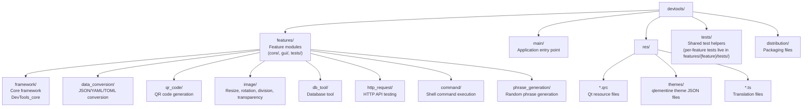
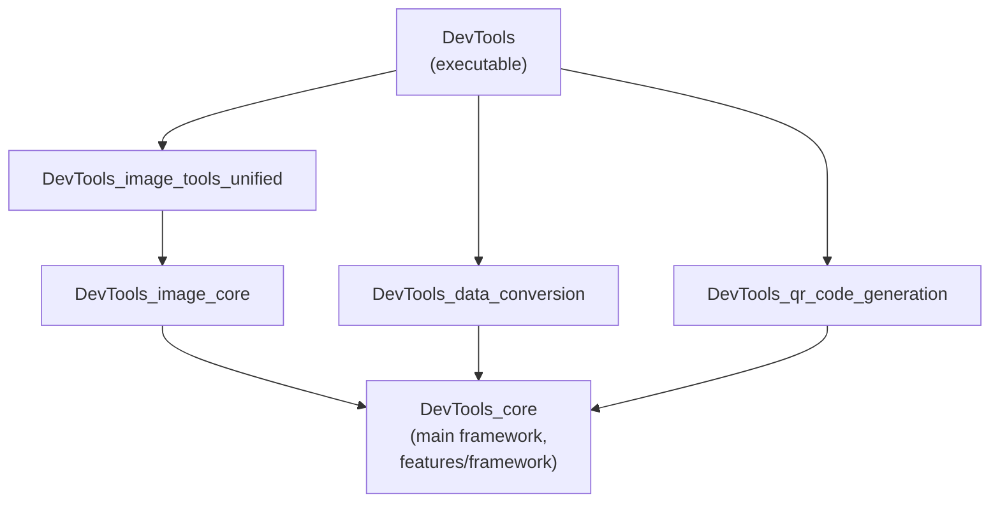
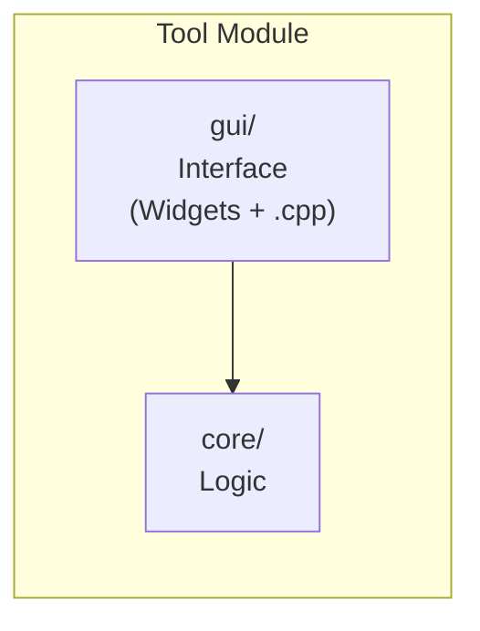
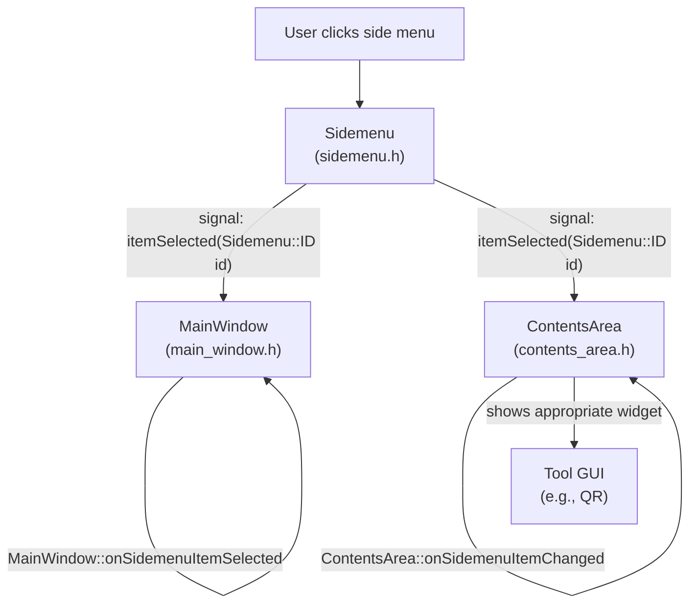
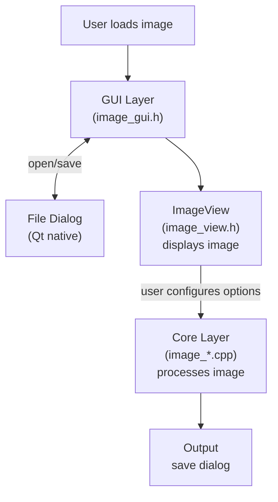
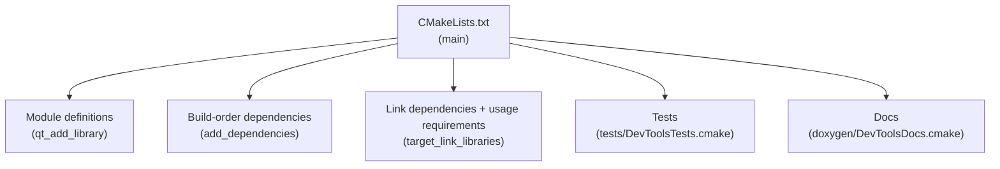
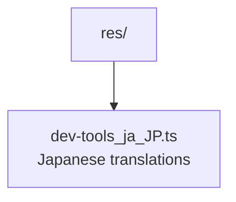
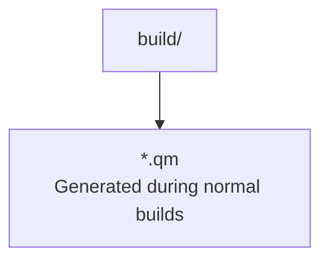
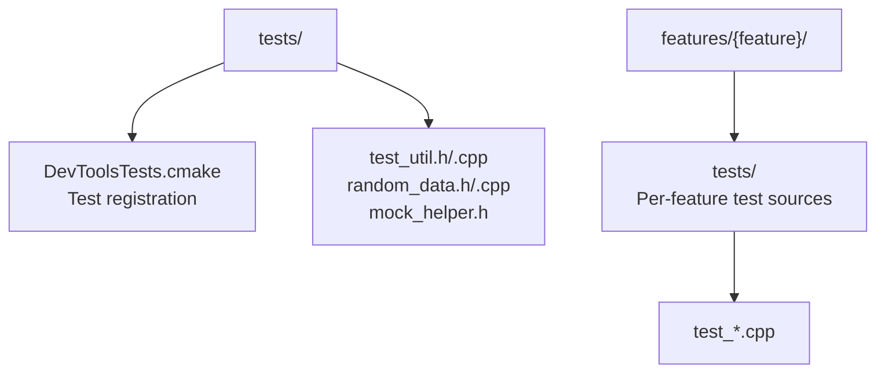

# System Architecture

This document describes the architecture of DevTools, including module structure, dependencies, and design patterns.

## Overview

DevTools is a Qt6-based desktop application built with C++17. The architecture uses a modular static library design to reduce compilation time and improve code organization.

## Technology Stack

| Component | Technology |
|-----------|------------|
| Language | C++17 |
| GUI Framework | Qt 6.x (Widgets) |
| Build System | CMake 3.21.1+ |
| Package Manager | vcpkg |
| Code Formatting | clang-format |
| Static Analysis | clang-tidy |

## Directory Structure

Each feature is a self-contained module under `features/{feature}/` with
`core/`, `gui/`, and `tests/` subdirectories. Shared application infrastructure
lives in `features/framework/` and is compiled as the `DevTools_core` library.



## Module Architecture

### Module Diagram



Other feature modules (`DevTools_http_request`, `DevTools_command`,
`DevTools_phrase_generation`, `DevTools_db_tool`) depend directly on
`DevTools_core` without intermediate shared modules.

### Module List

| Module | Description | Dependencies |
|--------|-------------|--------------|
| `DevTools_core` | Main framework (application, main window, side menu, tool base, exceptions). Sources live under `features/framework/`. | Qt6, qlementine |
| `DevTools_image_core` | Image I/O and editing base classes | DevTools_core |
| `DevTools_image_tools_unified` | Unified image processing tools (resize, rotation, division, transparency) | DevTools_image_core |
| `DevTools_data_conversion` | JSON/YAML/TOML conversion | DevTools_core, yaml-cpp, toml11 |
| `DevTools_qr_code_generation` | QR code generation | DevTools_core |
| `DevTools_http_request` | HTTP API testing | DevTools_core |
| `DevTools_command` | Shell command execution | DevTools_core |
| `DevTools_phrase_generation` | Random phrase generation | DevTools_core |
| `DevTools_db_tool` | Database tool | DevTools_core |

### Core Module Structure

`DevTools_core` encapsulates application infrastructure and is implemented in
`features/framework/`. Its sources are listed via `target_sources()` in
`features/framework/CMakeLists.txt`. Key components:

- **Application Framework**: `features/framework/gui/gui_application.cpp`, `features/framework/core/application_mixin.cpp`
- **Main Window**: `features/framework/gui/main_window.cpp`
- **Navigation**: `features/framework/gui/sidemenu.cpp`, `features/framework/gui/contents_area.cpp`
- **Dialogs**: `features/framework/gui/menubar/about_devtools_dialog.cpp`, `settings_dialog.cpp`
- **Shared UI Design System**: `features/framework/gui/design_system.h`, `design_system.cpp`
- **Tool Base**: `features/framework/gui/gui_tool.cpp`, `features/framework/core/tool/tool.cpp`
- **Exceptions**: `features/framework/core/exception/` (custom exception classes)

## Design Patterns

### MVC-like Architecture

Each tool follows a similar pattern:



- **core/**: Business logic, algorithms, no UI dependencies
- **gui/**: User interface, uses Qt Widgets

### Static Library Pattern

Each feature is compiled as a static library (`STATIC`). The library target is
declared in the root `CMakeLists.txt` with `qt_add_library(${PROJECT_NAME}_your_module STATIC)`
and the source files are listed in `features/your_module/CMakeLists.txt` via
`target_sources()`. The feature is then registered in `features/CMakeLists.txt`
with `add_subdirectory()`.

```cmake
# Root CMakeLists.txt
qt_add_library(${PROJECT_NAME}_your_module STATIC)

# features/your_module/CMakeLists.txt
target_sources(${PROJECT_NAME}_your_module PRIVATE
    core/your_module.h core/your_module.cpp
    gui/your_module_gui.h gui/your_module_gui.cpp
)
```

Benefits:
- Reduced compilation time (only changed modules recompile)
- Clear module boundaries
- Easier testing

## Data Flow

### Tool Selection Flow



### Image Processing Flow



## External Dependencies

### Qt6 Modules

| Module | Purpose |
|--------|---------|
| Qt6::Core | Core functionality |
| Qt6::Widgets | GUI components |
| Qt6::Network | HTTP requests |
| Qt6::Sql | Database operations |
| Qt6::LinguistTools | Translations |
| Qt6::Svg | SVG support required by qlementine |

### vcpkg Libraries

| Library | Purpose | Linking |
|---------|---------|---------|
| toml11 | TOML parsing | Header-only |
| yaml-cpp | YAML parsing | Static |

### Bundled Libraries

| Library | Purpose | Source |
|---------|---------|--------|
| qrcodegen | QR code generation | Project Nayuki |

### FetchContent Libraries

| Library | Purpose | Source |
|---------|---------|--------|
| qlementine v1.4.2 | Modern Qt Widgets `QStyle` and JSON theme support | `https://github.com/oclero/qlementine.git` |

qlementine is fetched by CMake instead of vcpkg because it is built against the active
system Qt6 installation. The project disables qlementine's sandbox and showcase targets and
links the style library into `DevTools_core`.

## Application Styling and Themes

DevTools uses qlementine as the application-wide `QStyle`:

1. `GuiApplication::setup()` creates `oclero::qlementine::QlementineStyle` and installs it
   with `QApplication::setStyle()`.
2. `oclero::qlementine::ThemeManager` loads JSON themes from the Qt resource prefix
   `:/themes`.
3. `GuiApplication::applyColorScheme()` maps the system color scheme to the qlementine
   `Light` or `Dark` theme and also switches the icon theme between `light` and `dark`.

Theme JSON files live in `res/themes/` and are registered in `res/application.qrc`. When
adding or renaming a theme, keep the `meta.name` value unique because qlementine's
`ThemeManager` uses it as the theme identifier.

Feature GUIs use `DevTools::Ui` for shared layout, widget configuration, and metrics.
Colors, borders, and text roles come from the active qlementine style.

## Build System

### CMake Structure



### Build Targets

| Target | Description |
|--------|-------------|
| `DevTools` | Main executable |
| `format` | Run clang-format |
| `format-check` | Check formatting |
| `lint` | Run clang-tidy |
| `lint-fix` | Run clang-tidy with fixes |
| `run` | Build and launch DevTools |
| `quality-check` | Run all quality checks |
| `DevTools_docs` | Generate Doxygen docs |

## Translation System

DevTools supports multiple languages using Qt translation tools:

Tracked translation sources:



Generated translation artifacts:



Translation workflow:
1. Write source strings in English and mark them with `tr()` in code
2. Run `cmake --build build --target update_devtools_translations` when strings change
3. Update the tracked `.ts` translations
4. Normal builds run `lrelease` to compile `.qm` files

## Testing Architecture

Per-feature tests live alongside the feature under `features/{feature}/tests/`.
Shared test helpers (mock utilities, random data generators) live under
`tests/`.



Tests are registered in `tests/DevToolsTests.cmake` via `DevTools_add_test()`.
See [Testing Guide](testing-guide.md) for details.

## Related Documentation

- [Adding New Tools](adding-new-tools.md) - How to add new tool modules
- [Coding Standards](coding-standards.md) - Code style guidelines
- [Testing Guide](testing-guide.md) - How to write tests
