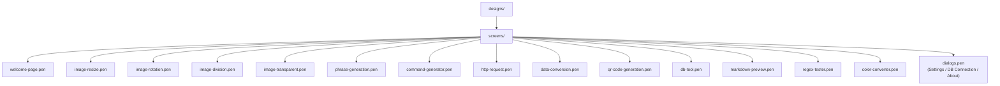

# Design Files

UI design files (`.pen`, [Pencil](https://pencil.app) format) are stored under `designs/screens/`.

## File Layout

One file per screen (or per related dialog group). The sidebar and other shared chrome are intentionally excluded from individual screen files so that an edit to one screen never touches another.

## Editing Workflow

1. Open the target file directly in the Pencil editor (do not use the master file pattern — there is no master).
2. Edit only the screen contained in the file. If a change requires touching the sidebar or another shared component, raise it as a separate discussion before introducing it.
3. Save and commit. Prefer one screen per pull request.

## Reusable Components

Shared UI primitives (buttons, inputs, checkboxes, tabs, radios) are **not** kept inline in each screen file. When you need a primitive while editing, recreate it in-file as needed or extract a shared library file in a follow-up PR.

## Git Handling

`.pen` files are tracked as regular files — no `binary` / `merge=binary` attributes are applied. Git will attempt text-based diff and auto-merge.

In practice, `.pen` payloads are encrypted, so a textual auto-merge can produce an unreadable file. Mitigations:

- Keep edits localized to one screen file per PR.
- Coordinate with the team before editing a `.pen` file someone else may also be touching.
- If a conflict does occur, open both branches' versions in Pencil, decide which to keep with `git checkout --ours <file>` / `--theirs <file>`, and re-apply the other branch's intent manually.

## Best Practices

- **One screen per PR** when possible — keeps diffs reviewable and reduces conflict risk.
- **Communicate** before editing shared screens.
- **Descriptive commits** so reviewers understand the design intent without opening the editor.
