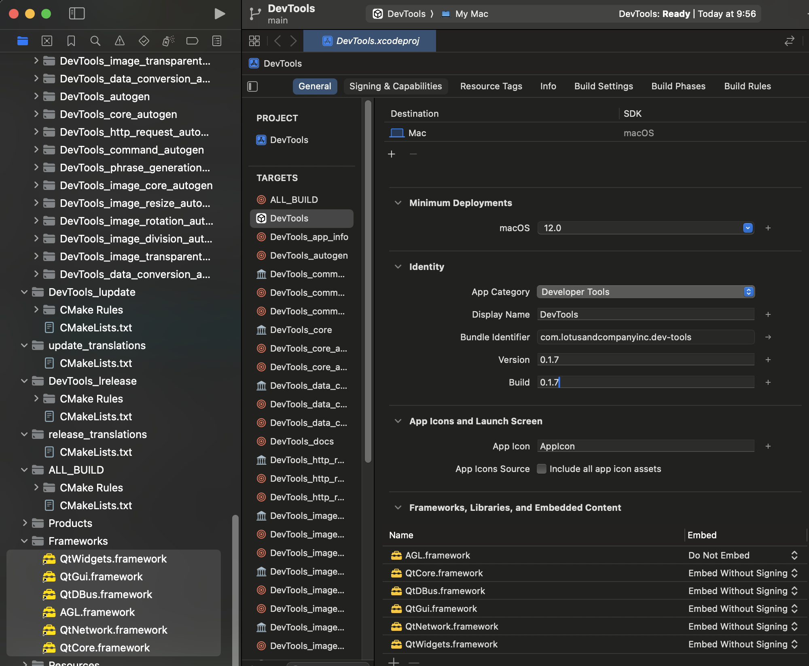
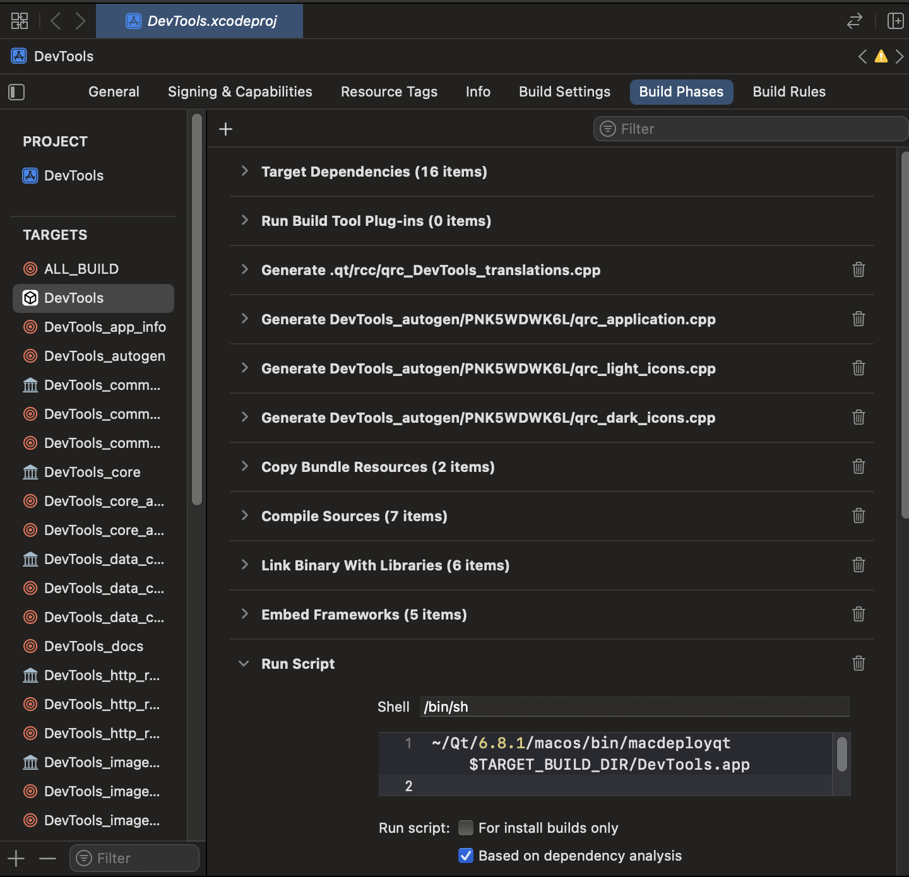

# 配布できる形にする
参考: [開発ノウハウ](https://drive.google.com/drive/folders/1LtCMztm9HaseApoA_vcSOMbkNlRQPgfB)

ドキュメントには書かれていませんが、Validate App実施前?までに[アプリ用パスワードを作成する](https://support.apple.com/ja-jp/102654)必要があるかも知れません。

1. ジェネレータをXCodeにしてプロジェクトをXCodeで開く
2. Qt系のライブラリをFrameworksからFrameworks, Librariesの所にドラッグ&ドロップして Embedded without signing に設定  
   AGLはDo not embeddedにする
   
3. 名前などを設定する
4. BuildPhasesにNew Run Script Phaseで以下を実行するフェーズを追加(`macdeployqt`の場所はバージョンに応じて変更する)
   `~/Qt/6.8.1/macos/bin/macdeployqt "$TARGET_BUILD_DIR/$PRODUCT_NAME.app" -appstore-compliant -codesign="$EXPANDED_CODE_SIGN_IDENTITY"`
   
5. Product > Archive、完了したらValidate App→Distribute App
6. App Store Connect側でテスターを追加し、しばらく待つと使えるようになる
