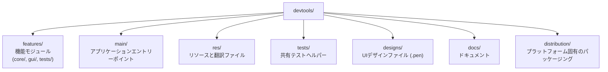

# DevToolsへの貢献

[English version](../../CONTRIBUTING.md)

DevToolsへの貢献に興味を持っていただきありがとうございます！このドキュメントでは、貢献のためのガイドラインと手順を説明します。

## 目次

- [行動規範](#行動規範)
- [はじめに](#はじめに)
- [貢献の方法](#貢献の方法)
- [開発ガイドライン](#開発ガイドライン)
- [プルリクエストのプロセス](#プルリクエストのプロセス)
- [リリースプロセス](#リリースプロセス)

## 行動規範

このプロジェクトは[Contributor Covenant行動規範](CODE_OF_CONDUCT.md)に従います。参加することで、この規範を遵守することが期待されます。

## はじめに

### 前提条件

貢献する前に、以下を確認してください：

1. [README](README.md)を読む
2. [BUILD.md](BUILD.md)に従って開発環境をセットアップ
3. プロジェクト構造を理解する

### プロジェクト構造



## 貢献の方法

### バグの報告

1. [Issues](https://github.com/LotusAndCompany/devtools/issues)で既に報告されていないか確認
2. 報告されていない場合、バグ報告テンプレートを使用して新しいIssueを作成
3. 以下を含めてください：
   - バグの明確な説明
   - 再現手順
   - 期待される動作と実際の動作
   - 環境情報（macOSバージョン、Qtバージョンなど）
   - 該当する場合はスクリーンショット

### 機能のリクエスト

1. 既存のIssueで類似の機能リクエストがないか確認
2. 機能リクエストテンプレートを使用して新しいIssueを作成
3. 以下を記述してください：
   - 解決しようとしている問題
   - 提案する解決策
   - 検討した代替案

### コードの提出

1. リポジトリをフォーク
2. `main`から機能ブランチを作成
3. 変更を加える
4. 必要に応じてテストを作成または更新
5. すべてのテストが通ることを確認
6. プルリクエストを提出

## 開発ガイドライン

### コードスタイル

- C++17の機能を適切に使用
- プロジェクト内の既存のコードパターンに従う
- 意味のある変数名と関数名を使用
- 複雑なロジックにはコメントを追加

### ローカライゼーション

- ユーザーに表示される source 文字列は英語で記述し、`tr()` でラップする
- 日本語翻訳は `res/dev-tools_ja_JP.ts` で管理する
- 英語は source 文字列を使用するため、英語用の `.ts` ファイルは追加しない
- 翻訳対象文字列を変更した場合のみ `.ts` を更新する：
  `cmake --build build --target update_devtools_translations`

### コードフォーマット

このプロジェクトでは、自動コードフォーマットに`clang-format`、静的解析に`clang-tidy`を使用しています。

#### セットアップ

ツールをインストール（macOS）：
```bash
brew install llvm
```

#### 使用方法

すべてのソースファイルをフォーマット：
```bash
cmake --build build --target format
```

変更なしでフォーマットをチェック：
```bash
cmake --build build --target format-check
```

静的解析を実行：
```bash
cmake --build build --target lint
```

自動修正付きで静的解析を実行：
```bash
cmake --build build --target lint-fix
```

#### Gitフック (pre-commit)

このプロジェクトでは[pre-commit](https://pre-commit.com/)を使用してコード品質チェックを自動化しています。

**インストール：**

```bash
# pre-commit をインストール
brew install pre-commit  # macOS
# または: pip install pre-commit

# フックをセットアップ
pre-commit install --install-hooks -t pre-commit -t pre-push
```

**フック一覧：**

| ステージ | フック | 説明 |
|---------|--------|------|
| pre-commit | clang-format | C++コードのフォーマット |
| pre-commit | trailing-whitespace | 末尾空白の削除 |
| pre-commit | end-of-file-fixer | ファイル末尾の改行 |
| pre-commit | check-added-large-files | 大きなファイルの追加を防止 |
| pre-push | cmake-build | ビルド成功の検証 |

**手動実行：**

```bash
# 全ファイルに対してすべてのフックを実行
pre-commit run --all-files

# 特定のフックを実行
pre-commit run clang-format --all-files

# 一時的にフックをスキップ
git commit --no-verify -m "WIP: work in progress"
git push --no-verify
```

**フックの更新：**

```bash
pre-commit autoupdate
```

#### CI (GitHub Actions)

コード品質チェックは以下のタイミングで自動実行されます：
- `main` への**プルリクエスト**時

| チェック | 実行環境 | 説明 |
|---------|---------|------|
| clang-format | macOS | 変更ファイルのフォーマットチェック |
| clang-tidy | Ubuntu | 変更ファイルの静的解析 |
| format-suggestion | macOS | PRにフォーマット修正提案をコメント |
| semantic-pr | Ubuntu | PRタイトルがConventional Commits形式に従っているか検証 |

#### IDE連携

- **Qt Creator**: 設定 > C++ > コードスタイル > `.clang-format`をインポート
- **VS Code**: 「clangd」拡張機能をインストール、`.clang-format`が自動的に使用されます
- **CLion**: 設定 > エディタ > コードスタイル > C/C++ > ClangFormatを有効化

### 命名規則

| タイプ | 規則 | 例 |
|-------|------|-----|
| クラス | PascalCase | `ImageResize` |
| 関数 | camelCase | `processImage()` |
| 変数 | snake_case | `image_width` |
| 定数 | SCREAMING_SNAKE_CASE | `MAX_IMAGE_SIZE` |
| ファイル | snake_case | `image_resize.cpp` |

### 新しいモジュールの追加

1. 機能ディレクトリ構造を作成：
   ```mermaid
   flowchart TD
       module["features/your_module/"]
       module --> cmake["CMakeLists.txt"]
       module --> core["core/"]
       core --> core_files["your_module.h<br/>your_module.cpp"]
       module --> gui["gui/"]
       gui --> gui_files["your_module_gui.h<br/>your_module_gui.cpp"]
       module --> tests["tests/"]
       tests --> test_file["test_your_module.cpp"]
   ```

2. ルートの`CMakeLists.txt`に静的ライブラリターゲットを登録：
   ```cmake
   qt_add_library(${PROJECT_NAME}_your_module STATIC)
   ```

3. `features/your_module/CMakeLists.txt`にソースファイルを列挙：
   ```cmake
   target_sources(${PROJECT_NAME}_your_module PRIVATE
       core/your_module.h core/your_module.cpp
       gui/your_module_gui.h gui/your_module_gui.cpp
   )
   ```

4. ルートの`CMakeLists.txt`の`MODULE_LIST`に追加：
   ```cmake
   set(MODULE_LIST
       # ... 既存のモジュール
       ${PROJECT_NAME}_your_module
   )
   ```

5. `features/CMakeLists.txt`に機能を登録：
   ```cmake
   add_subdirectory(your_module)
   ```

### テストの追加

`tests/DevToolsTests.cmake`にテストを追加：
```cmake
DevTools_add_test(test_your_module
    SOURCES
    features/your_module/tests/test_your_module.cpp
)
```

`cmake .. -DENABLE_UNIT_TEST=ON`でテストを有効化します。

### デザインファイル

UIデザインファイル（`.pen`、[Pencil](https://pencil.app) 形式）は `designs/screens/` 配下に画面・ダイアログ単位で格納されています。サイドバー等の共通要素は個別ファイルから除外し、編集の影響範囲を局所化しています。

ファイル構成・編集フロー・コンフリクト対応の詳細は [Design Files](../development/design-files.md) を参照してください。

## プルリクエストのプロセス

1. 必要に応じて**ドキュメントを更新**
2. 新機能の**テストを作成**
3. **CIがパス**することを確認（すべてのテストがパス、ビルドエラーなし）
4. メンテナーに**レビューをリクエスト**
5. **フィードバックに迅速に対応**
6. **プルリクエストをスカッシュマージ**

### PRタイトルのフォーマット

[Conventional Commits](https://www.conventionalcommits.org/)形式に従った明確で説明的なタイトルを使用してください。
タイトルはCIで自動検証されます。

**ルール:**
- subject（コロン以降）は小文字で始める（英語の場合）
- 現在形を使用

**例:**
- `feat: add SMS QR code generation`
- `fix: correct image rotation angle calculation`
- `docs: update build instructions for macOS`
- `refactor: simplify data conversion logic`

### レビュープロセス

1. メンテナーがPRをレビュー
2. 変更のリクエストや質問がある場合があります
3. 承認されると、PRがマージされます
4. あなたの貢献はChangelogで acknowledgement されます

## リリースプロセス

このプロジェクトでは[release-please](https://github.com/googleapis/release-please)を使用してリリース管理を自動化しています。

### 仕組み

1. **スカッシュマージしたPRタイトルでバージョンが決まります：**
   - PRタイトルが`main`上のスカッシュコミットのタイトルになります
   - `fix:` のPRタイトル → PATCHリリース
   - `feat:` のPRタイトル → MINORリリース
   - PRタイトルの`feat!`または`fix!` → MAJORリリース

2. **自動化ワークフロー：**
   - `main`に変更がマージされると、release-pleaseがRelease PRを作成/更新
   - Release PRには以下が含まれます：
     - 更新された`CHANGELOG.md`
     - `CMakeLists.txt`と`vcpkg.json`のバージョン更新
   - Release PRがマージされると、GitHubリリースとタグが自動作成

3. **release-pleaseが管理するファイル：**
   - `CMakeLists.txt` - プロジェクトバージョン
   - `vcpkg.json` - 依存関係バージョン
   - `version.txt` - プレーンテキストバージョン
   - `CHANGELOG.md` - リリースノート

### メンテナー向け

- リリース準備ができたら、自動生成されたRelease PRをレビューしてマージ
- バージョン番号やCHANGELOGを手動で編集しないでください（release-pleaseが処理します）
- PRタイトルはConventional Commits形式に従ってください。release-pleaseは、
  `main`上のスカッシュコミットのタイトルからバージョンを決定します

## 質問がありますか？

質問がある場合は、お気軽に：
- ディスカッション用のIssueを開く
- メンテナーに連絡する

DevToolsへの貢献ありがとうございます！
