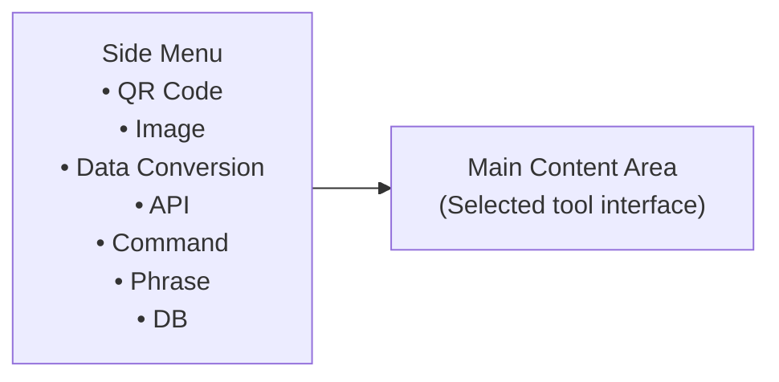

# Application Overview

DevTools is a unified desktop application that combines various development tools into a single, convenient interface.

## Purpose

DevTools eliminates the need for multiple web services by providing all essential developer utilities in one place. Instead of opening multiple browser tabs for different tools, you can access everything from a single application.

## Main Features

| Feature | Description |
|---------|-------------|
| [QR Code Generation](qr-code-generation.md) | Create QR codes for text, URLs, emails, phone numbers, SMS, and locations |
| [Image Processing](image-processing.md) | Resize, rotate, split images, and add transparency |
| [Data Conversion](data-conversion.md) | Convert between JSON, YAML, and TOML formats |
| [API Testing](api-testing.md) | Send HTTP requests and view responses |
| [Command Execution](command-execution.md) | Run shell commands from the GUI |
| [Phrase Generation](phrase-generation.md) | Generate random text and phrases |
| [Database Management](database-management.md) | Connect to databases and execute SQL queries |

## User Interface

### Layout

### Side Menu

The side menu provides navigation between tools:

- Click a tool name to switch to that tool
- The current tool is highlighted
- Icons help identify each tool quickly

### Main Content Area

The main content area displays the selected tool's interface. Each tool has its own UI designed for its specific purpose.

### Menu Bar

| Menu | Contents |
|------|----------|
| **File** | Close Window, Show Main Window |
| **DevTools** | About DevTools, Settings |

## Settings

Open settings via **DevTools > Settings**.

### General Settings

- **Language**: Switch between English and Japanese
- **Show sidebar on startup**: Show or hide the side menu when the app starts
- **Open last used tool on startup**: Restore the last selected tool

### Window Settings

- **Always on top**: Keep the main window above other windows
- **Remember window size**: Restore the previous window size
- **Remember window position**: Restore the previous window position

## Keyboard Shortcuts

| Shortcut | Action |
|----------|--------|
| `Ctrl + W` | Close Window |

## Themes

The application follows the macOS system appearance. When macOS switches between
light and dark mode, DevTools updates the qlementine widget theme and icon theme
automatically.

## Language Support

DevTools is available in:

- **English** (default)
- **Japanese** (日本語)

To change language:
1. Open **DevTools > Settings**
2. Select the **Language** tab
3. Choose your language
4. Click **Apply** or **OK**; the UI changes immediately

## File Formats

### Supported Input Formats

| Tool | Formats |
|------|---------|
| Image Processing | PNG, JPEG, BMP, GIF, TIFF |
| Data Conversion | JSON, YAML, TOML |

### Supported Output Formats

| Tool | Formats |
|------|---------|
| QR Code | PNG |
| Image Processing | PNG, JPEG |
| Data Conversion | JSON, YAML, TOML |

## System Requirements

- **OS**: macOS 15.0 or later
- **Architecture**: Apple Silicon (arm64)
- **Memory**: 4GB RAM recommended
- **Storage**: 100MB free space

## Getting Help

- [Common Issues](../troubleshooting/common-issues.md)
- [FAQ](../troubleshooting/faq.md)
- [GitHub Issues](https://github.com/LotusAndCompany/devtools/issues)

## Related Documentation

- [Quick Start](../getting-started/quick-start.md) - Get started quickly
- [Installation](../getting-started/installation.md) - Setup instructions
